# Test UI with Playwright (for beginner)

1. [Pre-requisites](#pre-requisites)
2. [Configure](#configure)
3. [Execute tests](#execute-tests)
4. [Test execution with UI](#test-execution-with-ui)
5. [Trace and Debug](#trace-and-debug)

## Pre-requisites
- **[git](https://git-scm.com/book/en/v2/Getting-Started-Installing-Git)** to retrieve source code
- **[nodejs](https://nodejs.org/en)** 

## Configure

### VSCode Playwright extension
Open VSCode and click on 'Extensions' button
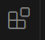
Then searche for playwright and the very first thing which has a check mark of Microsoft wiich is official plugin of th Microsoft. You will need to click the button install.

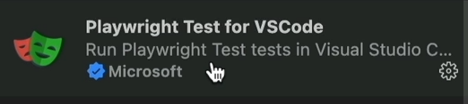


### Playwright installation
Create a new test 'demo-test' project and open it in VSCode.

Open a new terminal session and execute command:

```sh
npm init playwright@latest

# Sometime we can need to pass force
npm init playwright@latest --force
```

We will use a TypeScript since this is a default language for the playwright documentation.
We keep default tests folder and GitHub workflow actions at true

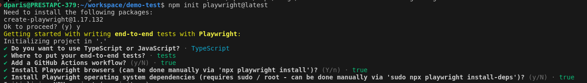

You can see  that we have a new folder structure showed up.

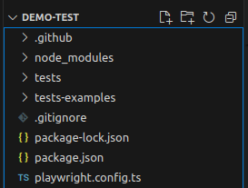

&nbsp;


- **node modules**. This is the place where in NodeJs applications we keep our libraries or components.
Inside of the node modules you can see the playwright folder. So playwright framework is sitting as a part of our framework.

- **tests** folder is the folder with our test files. In exemple.spec.ts we can see as an example we have two tests created. The naming convention for the test files called *.spec.ts

- **tests-examples** folder is just more examples of what playwright can do.

- **.gitignore** file automatically added the folders that we don't want to commit into the git repository

- **package.json** is the file to describe our overall project npm scripts and dev dependencies of any packages.

- **package-lock.json** is a file that kind of locking the configuration of your framework 

- **playwright.config.ts** is the main configuraiton file of the playwright 

## Execute tests
In a terminal, execute command:
```sh
npx playwright test
```
There are 6 past tests, because by default Playwright runs these tests in three browsers. Browsers are defined in playwright.config.ts : the **projects** project chromium, Firefox and WebKit

Open report as HTML page, execute command:
```sh
npx playwright show-report
```
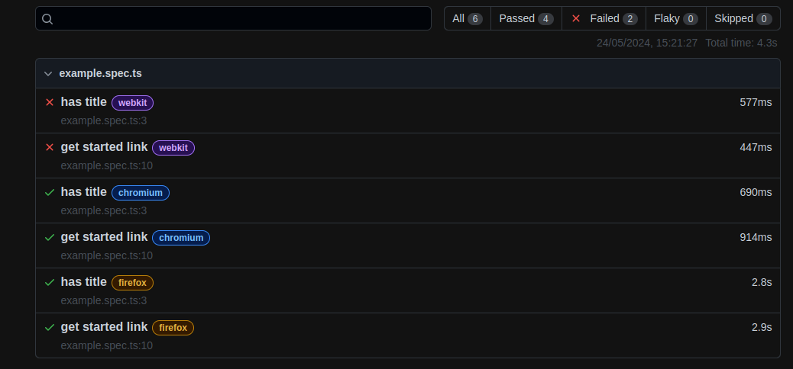

Execute command: tests for the specific browser
```sh
npx playwright test --project=chromium
```

Execute command: tests headed. During the execution, playwright run a browser
```sh
npx playwright test --project=chromium --headed
```

Execute command: one specific file, run
```sh
npx playwright test example.spec.ts --project=chromium --headed
```

Execute command: one name of the test, 

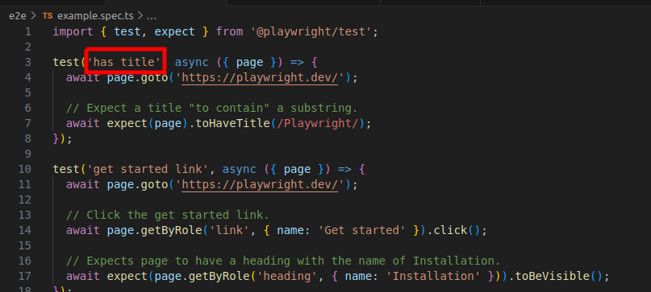

```sh
npx playwright test -g "has title" --project=chromium --headed
```

> - If test has title to ignore from execution. Add 'skip' to test
> 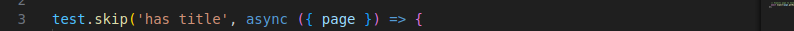
> - If test has one title to run from execution (other titles are skiped). Add 'only' to test
> 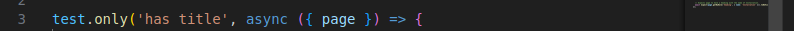

## Test execution with UI

### VSCode

Click on the left '**Testing**' button

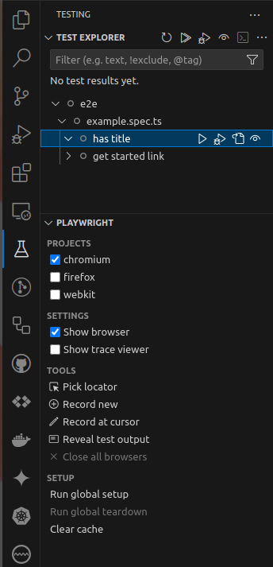

We can :
- select the test to execute
- execute test headless or not with 'show browser'
- select browsers

Click on 'run test' button to execute the test.
On the command line, the test ends. Here the browser still stays open after the test execution.

> Execution time of each test is added to the test.

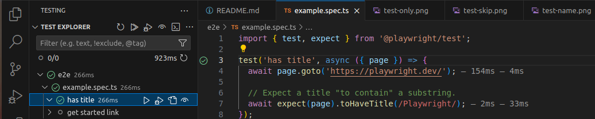

### Playwright UI

In a terminal, execute command:
```sh
npx playwright test --ui
```
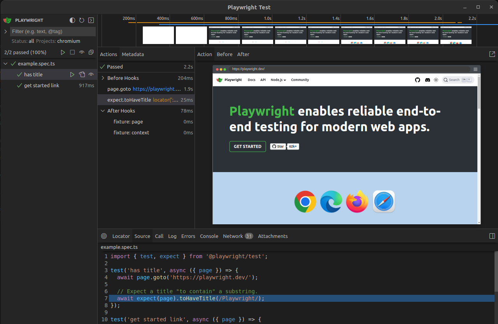

>  * The image is a sceenshot (navigation on the website is not possible)
>  * We can trigger the test to run if we have made any changes. Just click on on the watch icon

For each of the command we can explore three **states** of the action.

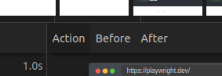

- **Action** is the action state when the action happenedd
- **Before** explore what was before the action
- **After** is the state of the page after the action

## Trace and Debug

### Trace

By default, trace is configured 'on-first-retry: if the test failed for the first time on the first retry when playwright tried to rerun failed test, it will automatically generate a trace and attach to the report.

Trace 'on' always create a trace for each every test even those that are successful execution.

```sh
npx playwright test --project=chromium --trace on

#To open last HTML report run:

npx playwright show-report
```

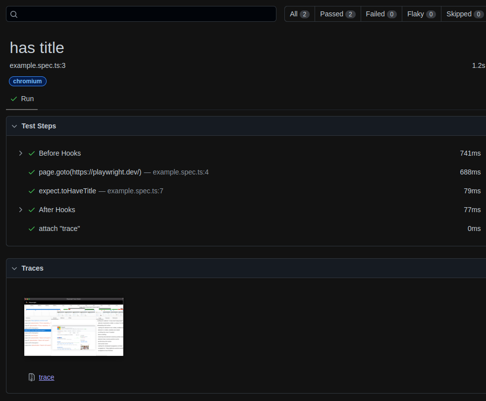

This looks like a normal report. If we open the report, there is a **traces** section.
Click on the trace, so we have all the steps that were performed like Playwright UI runner.

> Note!
> Run CI server, having this trace on is very useful to analyze the test.

### Playwright debugger

```sh
npx playwright test --project=chromium --debug
```
Playwrigth open two windows. one is playwright inspector and the second is browser.
Click on 'resume' icon or F8 to run the test.
Click on 'step over' or F10 to run the test step by step.

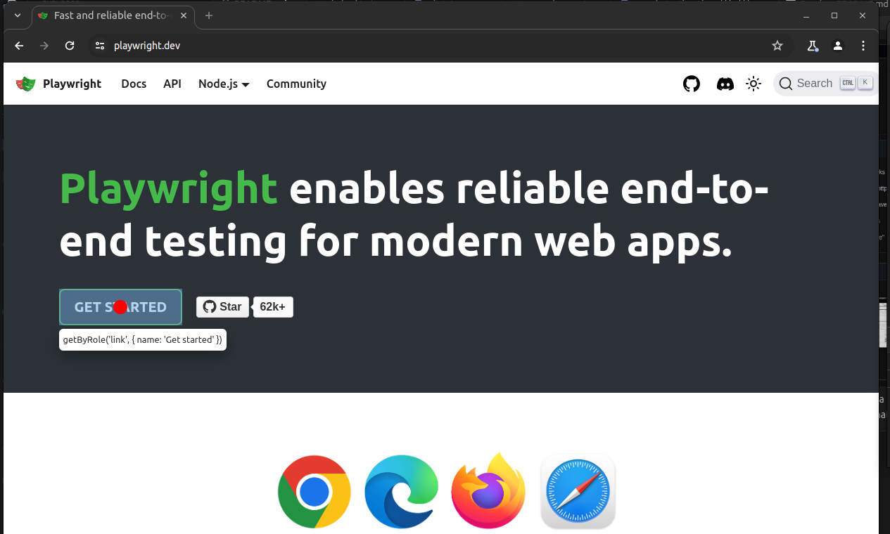
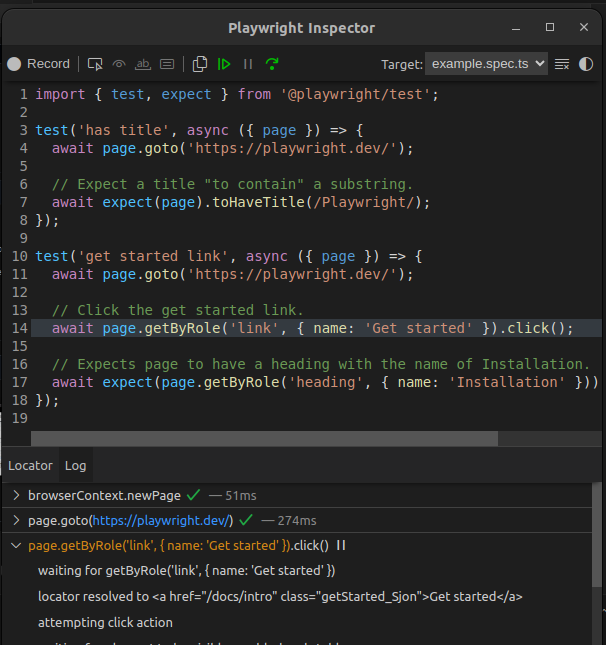

In the debugger console, playwright log what is going on.

### VSCode debug explorer

Put a break point at the line of code where debugger must stop.

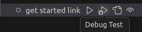

Then click on 'Debug test' button. So playwright run browser in the debug mode.
Visual Studio change the look and it's highlighted of line of code where the code is stopped.

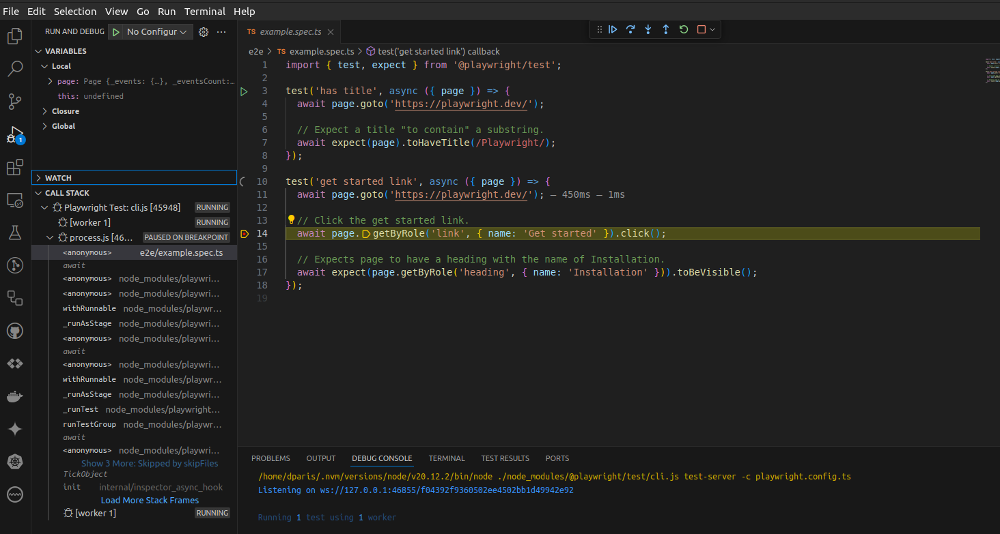

**Call stack** tab show details about what is going on.

The available buttons allow you to continue debugging.

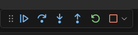

* Continue or F5 continues the test until the next break point
* Step over or F10 moving to the next step
* Step Into or F11 moving to the function called
* Step Out or Shift F11 to come back to the call of the function

> In break point, by hovering over variables, tool tip show what values are.
> Or right click on a variable and **Evaluate in Debug console** or **Add to watch** 
> to inspect the variable and track its progress during the test.
>If the code is complex, this method shows the data used and the values of variables live in the code, 
> step by step, helping you to understand the code better.

### JetBrains debug configuration

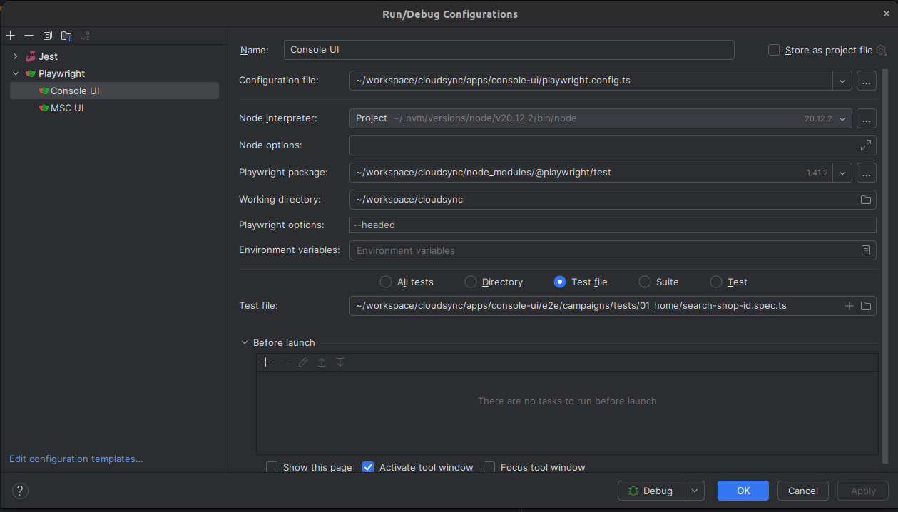


